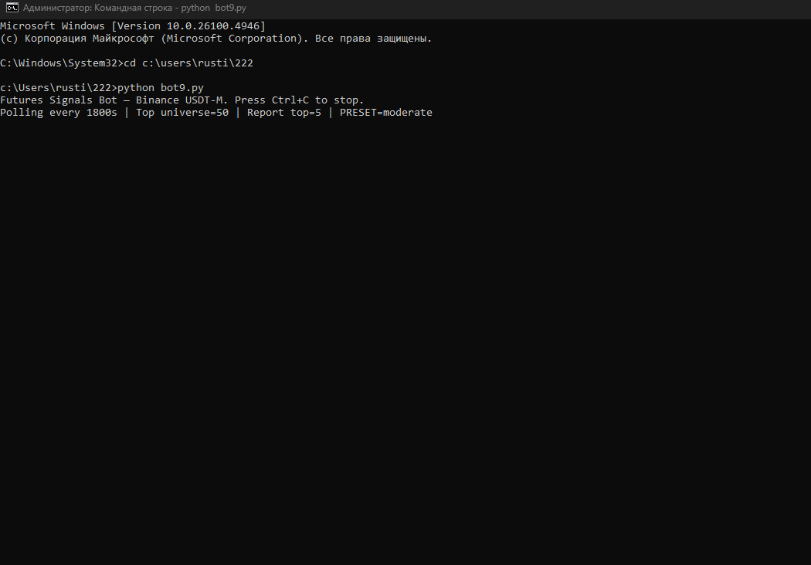
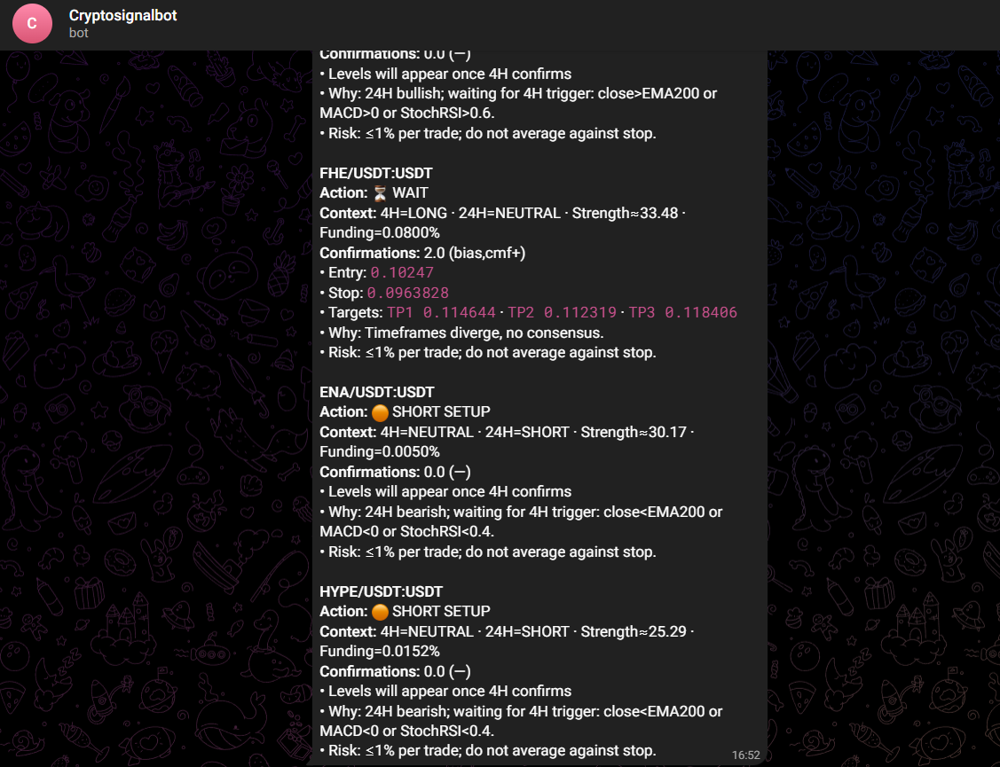

# binance-futures-bot
A Python-based trading bot for Binance USDT-M Futures. The bot analyzes market data, generates trading signals, and sends instant notifications to Telegram.
🔑 Key Features

Core Strategy: EMA200 + RSI for trend detection

Filters: ADX and volume confirmation

Additional Signals: MACD, Bollinger Bands, Stochastic RSI

Risk Management: ATR-based stop-loss and take-profit levels

Multi-timeframe Analysis: 4H (trend setup) and 24H (macro context)

Telegram Integration: automatic alerts for top trading pairs

🛠 Tech Stack

Python 3.x

ccxt (Binance API)

pandas, numpy

ta (technical indicators)

python-telegram-bot

matplotlib (for optional charting)

📊 Example Output
BTC/USDT  4H = LONG  |  24H = NEUTRAL
Strength ≈ 37.5  |  Funding = -0.0012%
Confirmations: MACD > 0, RSI > 50

### 📷 Example Screenshots

**1. Console output with trading signal:**  
When the bot runs, it prints real-time signals based on EMA200 + RSI + ADX strategy.  

---

**2. Telegram notification:**  
Signals can also be sent directly to a Telegram chat using the integrated bot.  

🚀 How to Run
git clone https://github.com/yourusername/binance-futures-bot.git
cd binance-futures-bot
pip install -r requirements.txt
python bot.py
